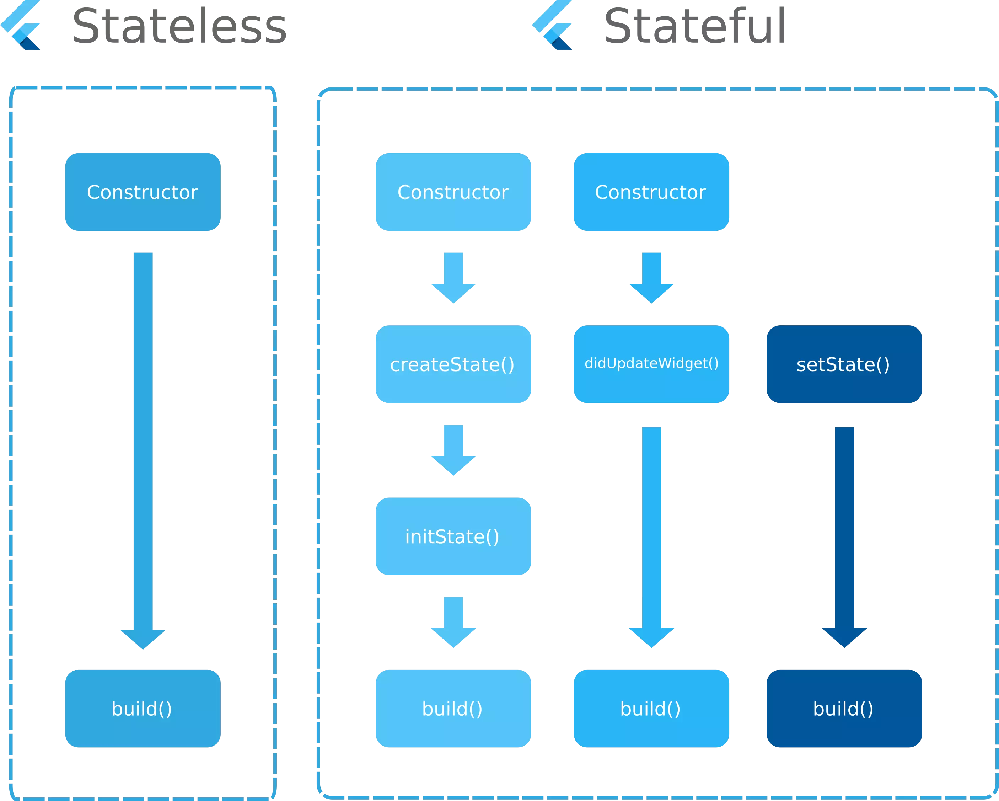

# 플러터 입문

## 위젯의 생명주기

### `StatelessWidget` 생명주기
1. 상태 클래스의 생성자가 호출됨
2. `build()` 메서드를 통해 `Widget`이 화면에 랜더링 됨

### `StatefulWidget` 생명주기
1. 상태 변경이 없는 생명주기
    1. 상태 클래스의 생성자가 호출됨
    2. `Widget`이 mount 됨
    3. `initState` 가 호출 됨.  
       `initState`는 `Widget`이 마운트 될 때 한번만 실행 됨.
    4. 처음 mount 될 때 `dirty` 상태로 위젯이 `build()`되고 `dirty` 상태를 `clean` 상태로 변경 됨.  
      (`dirty`, `clean`는 위젯을 다시 build 할지 말지를 결정하는 Widget의 내부 상태 값임.)
    5. `Widget`이 대기상태가 됨.
    6. `Widget`이 `unmount`가 되면 `Widget`을 `deactivate()` 시키고 `dispose()` 메서드가 실행 되면서 `Widget`이 트리에서 사라짐.
2. 생성자 매개변수가 변경 됐을 때 생명주기
    1. 상태 클래스의 생성자가 호출됨
    2. `didUpdateWidget()`이 상태를 `dirty`로 변경 함.
    3. `Widget`이 `dirty` 상태로 변경 됐기 때문에 다시 `build()`되고 `dirty` 상태를 `clean` 상태로 변경 됨.
    4. `Widget`이 대기상태가 됨.
3. 자체 `state`가 변경 됐을 때 생명주기
    1. `setState()`를 통해 `Widget`이 `dirty` 상태임을 알림.
    2. `Widget`이 `dirty` 상태로 변경 됐기 때문에 다시 `build()`되고 `dirty` 상태를 `clean` 상태로 변경 됨.
    3. `Widget`이 대기상태가 됨.
