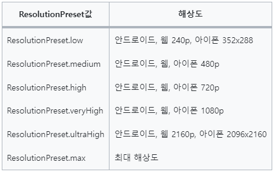
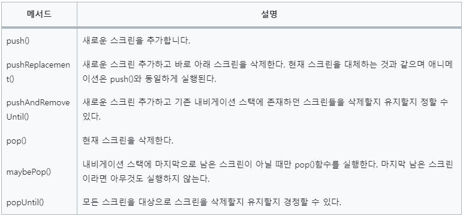
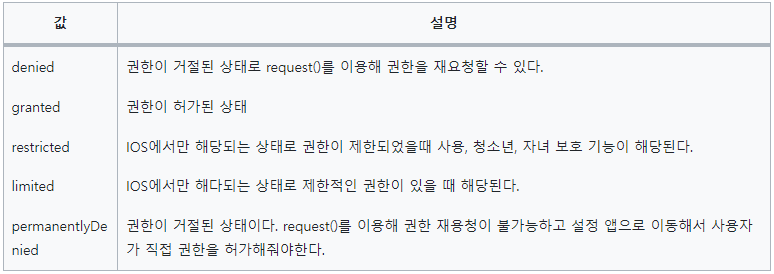

# 앱을 만들며 유용한 기능 익히기
## 13. 영상 통화
- 아고라 API 를 이용한 영상통화기능 구현
### 13.1 사전지식
#### 13.1.1 카메라 플러그인
- 카메라 플러그인을 설치한다
- camera: 0.10.5+5
- main() 함수의 첫 실행값이 runnApp()이면 WidgetsFlutterBinding.ensureInitialized() 가 불필요
  다른 코드가 먼저 실행돼야 하면 먼저 실행해야 한다
- ResolutionPreset 정보
  

#### 13.1.2 WebRTC
- WebRTC 를 사용하기 위해서는 중계용 서버가 필요
- 이를 시그널링 서버라고 하는데 아고라 서비스를 이용한다
#### 13.1.4 내비게이션
- 플러터에서 화면을 이동할 때 사용하는 클래스
- 스택 구조로 설계 되어 있다
- Navigator 클래스에서 제공하는 함수
  

### 13.2 사전 준비
#### 13.2.1 아고라에서 필요한 상수값 가져오기
- App ID, Channel Name, Token 값을 프로젝트에 넣어준다
#### 13.2.4 네이티브 설정하기
- 네트워크 상태를 읽는 READ_PHONE_STATE, ACCESS_NETWORK_STATE
- 녹음과 녹화 기능과 관련된 RECORD_AUDIO, MODIFY_AUDIO_SETTINGS
- 블루투스를 이용한 녹음 및 녹화 기능과 관련되 BLUETOOTH_CONNECT
#### 13.2.5 플러터에서 권한 관리
- permission_handler 패키지를 사용
- PermissionStatus 클래스
  

### 구현하기
- 기기가 1개 뿐이라서 테스트를 하지 못한다면
- https://webdemo.agora.io/basicVideoCall/index.html 에 접속해서 테스트 가능
