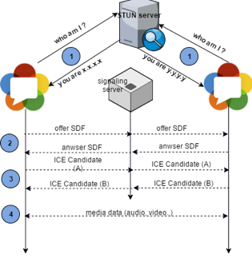
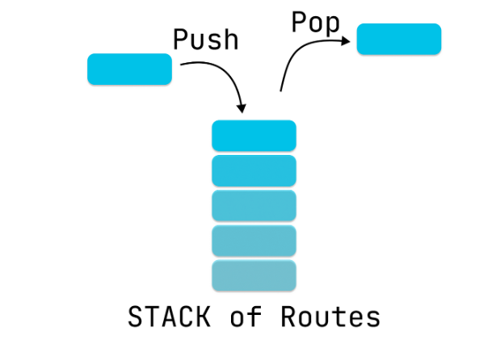

# 영상통화

## 사전지식

### 카메라 플러그인
1. 플러그인추가
    ```dart
        dependencies:
        flutter:
            sdk: flutter
        camera: ^0.11.0+1
    ```
2. 예제코드
    - `day10/video_sample`에서 확인

### WebRTC
> WebRTC(Web Real-Time Communication)는 웹 브라우저 간에 플러그인의 도움 없이 서로 통신할 수 있도록 설계된 API이다. 음성 통화, 영상 통화, P2P 파일 공유 등으로 활용될 수 있다.
>
> 애플, 구글, 마이크로소프트, 모질라 및 오페라가 지원하는 WebRTC 사양은 W3C(World Wide Web Consortium) 및 IETF(Internet Engineering Task Force)에서 게시되었다.
>
> webrtc.org 웹사이트에 따르면, 이 프로젝트의 목적은 브라우저, 모바일 플랫폼 및 IoT 장치용으로 풍부한 고품질 RTC 애플리케이션을 개발하고 공통 프로토콜 세트를 통해 모두 통신할 수 있도록 하는 것이다.

1. `WebRTC`를 사용하려면 두 클라이언트와 `Signalling Server`라고 하는 `중계서버`가 필요함.

2. `클라이언트`와 `서버`간의 정보 흐름  


3. `IOS 시뮬레이터`와 `안드로이드 시뮬레이터`에서 카메라 기능 사용

    ||IOS|안드로이드|
    |---|:---:|:---:|
    |제공여부|❌|✅|

### [네비게이터](https://api.flutter.dev/flutter/widgets/Navigator-class.html)

- `Flutter`에서 화면 이동 클래스
- `LIFO Stack`구조로 되어 있음  
    
- Navigator의 Methods
    |메서드|설명|
    |---|---|
    |push|새로운화면추가|
    |pushReplacement|새로운화면을 추가하면서 바로아래 화면을 삭제함|
    |pushAndRemoveUntil|새로운 화면을 추가하면서 아래화면 모두 삭제함|
    |pop|현재화면을 삭제함|
    |maybePop|스텍의 마지막이 아닐때만 pop을 실행함|
    |popUntil|스텍에 존재하는 화면으로 이동하면서 중간의 화면 모두 삭제|

## 실습

### 아고라 [https://www.agora.io](https://www.agora.io/kr/)
- 음성통화와 영상통화기능 API를 제공하는 서비스(유료)
- 10,000분까지 무료

### 권한설정
- Android
    ```xml
        <!-- \/\/네임스페이스 추가 -->
     ... xmlns:tools="http://schemas.android.com/tools" />
    ```
    ```xml
        <!-- \/\/권한추가 -->
        ...
        <uses-permission android:name="android.permission.READ_PHONE_STATE" />
        <uses-permission android:name="android.permission.INTERNET" />
        <uses-permission android:name="android.permission.RECORD_AUDIO" />
        <uses-permission android:name="android.permission.CAMERA" />
        <uses-permission android:name="android.permission.MODIFY_AUDIO_SETTINGS" />
        <uses-permission android:name="android.permission.ACCESS_NETWORK_STATE" />
        <uses-permission android:name="android.permission.BLUETOOTH" />
        <uses-permission android:name="android.permission.ACCESS_WIFI_STATE" />
        <uses-permission android:name="android.permission.READ_EXTERNAL_STORAGE" />
        <uses-permission android:name="android.permission.WAKE_LOCK" />
        <!-- \/\/ 최신버전에서는 사용 불가함.
        <uses-permission android:name="android.permission.READ_PRIVILEGED_PHONE_STATE" tools:ignore="ProtectedPermissions"/>-->
        ...
    ```
- IOS
    ```xml
    ...
    <key>NSCameraUsageDescription</key>
    <string>카메라 사용을 허가해주세요.</string>
    <key>NSMicrophoneUsageDescription</key>
    <string>마이크 사용을 허가해주세요.</string>
    ...
    ```

### Flutter에서의 권한관리

```dart
// 하나의 권한만 요청 시
...
final permission = await Permission.camera.request();

if (permission == PermissionStatus.granted) {
    // 권한 허가 시
} else {
    // 권한 미허가 시
}
...
```
```dart
// 여러개의 권한 요청 시
final resp = await [Permission.camera, Permission.microphone].request();

if (resp[Permission.camera] != PermissionStatus.granted) {
    throw '카메라 권한이 없음';
}

if (resp[Permission.microphone] != PermissionStatus.granted) {
    throw '마이크 권한이 없음';
}
```
