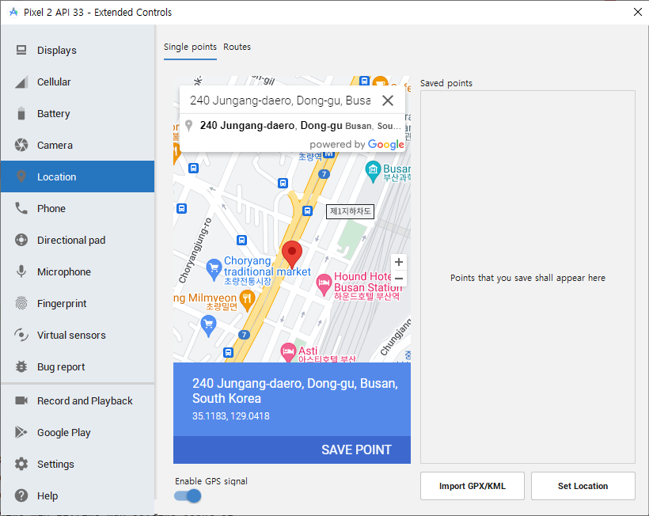

# 앱을 만들며 유용한 기능 익히기
## 14. 오늘도 출첵 
- 특정 위치의 위도, 경도부터 100 미터 이내에서 출근 체크 기능을 제공하는 앱
### 14.1 사전지식
#### 14.1.1 Geolocator 플러그인
- 지리와 관련된 기능을 쉽게 사용할 수 있는 플러그인
- 위치 서비스 사용 권한을 확인하고 요청
- GPS 위치가 바뀔 때마다 현재 위치값을 받을 수 있는 기능
- 회사 건물 간의 거리를 계산하는 기능
  

- getPositionStream() 함수를 이용하면 현재 위치가 변경될 때마다 주기적으로 반환 받는다
- position 속성

### 14.2 사전 준비
#### 14.2.1 구글 지도 API 키 발급받기
- App ID, Channel Name, Token 값을 프로젝트에 넣어준다
#### 14.2.2 pubspec.yaml 설정하기
- google_maps_flutter 플러그인 설치
- `Your project requires a newer version of the Kotlin Gradle plugin` 오류 발생
- project > android > settings.gradle 에서 org.jetbrains.kotlin.android 의 버전을 최신으로 바꿔준다
#### 14.2.3 네이티브 코드 설정하기
- androidManifest.xml 파일에 상세 위치 권한과 구글지도 API 키를 등록한다
### 14.3 레이아웃 구상하기
- AppBar : 중앙에 타이틀을 위치
- Body : 구글 지도를 보여주는 역할
- Footer : 출근하기 기능을 구현
### 14.4 구현하기
#### 14.4.1 앱바 구현하기
- renderAppBar()
#### 14.4.2 Body 구현하기
- 회사의 위도, 경도 정보를 LatLng 클래스에 저장
- Scaffold 의 body 에 GoogleMap 위젯을 넣어준다
#### 14.4.3 Footer 구현하기
- footer 와 body 가 화면을 나눠서 차지하도록 Column 위젯에 감싼 후 body 와 footer 비율을 2:2 로 구현
#### 14.4.4 위치 권한 관리하기
- checkPermission() 함수를 HomeScreen 위젯에 구현
#### 14.4.5 화면에 마커 그리기
- Marker 클래스를 사용해서 마커별로 ID 를 정해주고 위치를 입력
#### 14.4.6 현재 위치 반경 표시하기
- 현재 위치에서 반경을 원 모양으로 표시
- Circle 클래스 사용
- 시뮬레이터와 에뮬레이터에서 현재 위치 설정하기

#### 14.4.7  현재 위치 지도에 표시하기
- myLocationEnabled 를 true 로 변경
#### 14.4.8 출근하기 기능 구현하기
- `출근하시겠습니까?` > `출근하기` 또는 `취소` 선택
- `출근하기` 에서 100m 밖이면 `출근할 수 없는 위치입니다`
