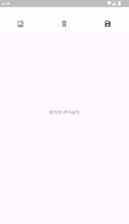
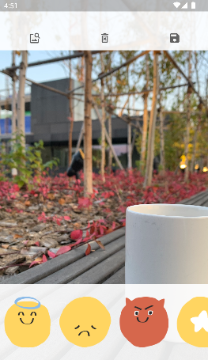
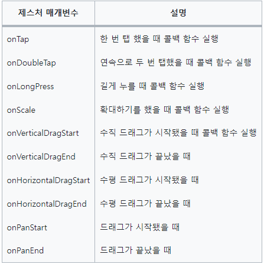
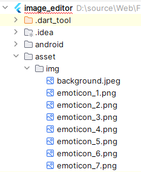
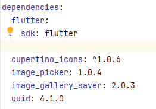
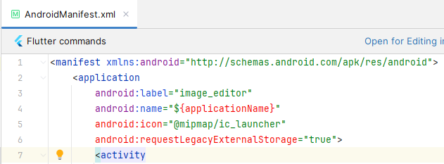
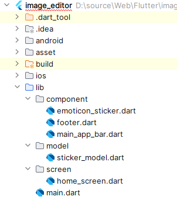

# 앱을 만들며 유용한 기능 익히기
## 15. 포토 스티커
- 이미지를 선택하고 이미지에 스티커를 붙여서 꾸미는 앱을 만든다
- 수정한 이미지를 저장한다



### 15.1 사전 지식
#### 15.1.1 GestureDetector 와 제스처
- GeustureDetector : flutter 에서 지원하는 모든 제스처들을 구현할 수 있는 위젯
- 제스처가 인식되면 매개변수에 입력된 콜백 함수가 실행된다



### 15.2 사전 준비
#### 15.2.1 가상 머신에 이미지 추가하기
- background.png 파일을 에뮬레이터로 복사한다
#### 15.2.2 이미지와 폰트 추가하기

#### 15.2.3 pubspec.yaml 설정하기
- image_picker, image_gallery_saver, uuid 플러그인 설치


#### 15.2.4 네이티브 코드 설정하기
- iOS 권한 설정하기
  - Info.plist 에 사진첩, 카메라, 마이크 권한 추가
    ```dart
    <dict>
        <key>NSPhotoLibraryUsageDescription</key>
        <string>사진첩 권한이 필요해요.</string>
        <key>NSCameraUsageDescription</key>
        <string>카메라 권한이 필요해요.</string>
        <key>NSMicrophoneUsageDescription</key>
        <string>마이크 권한이 필요해요.</string>
    </dict>
    ```
- 안드로이드 권한 설정
  - 안드로이드 11 버전에 새로운 파일 저장소가 추가
  - 사용자의 핸드폰이 안드로이드 11 이전 버전이면 기존 저장소를 사용해야 한다
    - requestLegacyExternalStorage 옵션을 true 로 설정



#### 15.2.5 프로젝트 초기화하기



### 15.3 레이아웃 구상하기
- home screen 하나의 스크린으로 구성
  - AppBar, Body, Footer 3등분 
  - AppBar : 이미지 선택, 스티커 삭제, 이미지 저장
  - Body : 선택한 이미지 표시
  - Footer : 스티커 목록
  - 이미지 선택 전 화면

    

  - 이미지 선택 후 화면

    

### 15.4 구현하기
#### 15.4.1 AppBar 구현하기
- [이미지 선택], [스티커 삭제], [이미지 저장] 버튼 구현
- 각 버튼에 onPressed 매개변수로 onPickImage, onDeleteItem, onSaveImage 선언
- lib/component/main_app_bar.dart
#### 15.4.2 Image 선택하기
- image 변수에 선택한 이미지를 저장한다
- ImagePicker 패키지의 pickImage() 를 이용하여 이미지 선택 창을 열어 선택한다
- ImageSource.gallery 를 선택하여 갤러리에서 이미지를 고를 수 있다
- lib/screen/home_screen.dart
    ```dart
    class _HomeScreenState extends State<HomeScreen> {
    XFile? image; // 선택한 이미지를 저장할 변수
        
    void onPickImage() async {
        final image = await ImagePicker()
            .pickImage(source: ImageSource.gallery); // 갤러리에서 이미지 선택하기

        setState(() {
            this.image = image; // 선택한 이미지 변수에 저장하기
        });
    }
    ```
#### 15.4.3 Body 구현하기
- 화면 1 : [이미지 선택하기] 버튼을 화면 중앙에 보여준다
- 화면 2 : 선택된 이미지를 화면에 보여준다
  - InteractiveViewer 를 사용해서 Image 를 확대하고 좌우로 이동할 수 있게 한다
    - 이미지 확대 및 축소 : 윈도우에서 `Ctrl` 키 + 마우스 드래그
- lib/screen/home_screen.dart
    ```dart
    Widget renderBody() {
        if (image != null) {
        // 이미지 선택된 경우    
            return Positioned.fill(  // 최대 크기 만큼 차지                            
                child: InteractiveViewer(   // 위젯 확대, 좌우 이동                   
                    child: Image.file(
                        File(image!.path),
                        fit: BoxFit.cover,  //이미지가 부모 위젯 크기 최대로 차지
                    ),                                    
                ),
            );       
        } else {
        // 이미지 선택 안 된 경우
            return Center(
                child: TextButton(
                    style: TextButton.styleFrom(
                        foregroundColor: Colors.grey,
                    ),
                    onPressed: onPickImage,
                    child: Text('이미지 선택하기'),
                ),
            );
        }
    }
    ```
#### 15.4.4 Footer 구현하기
- 이미지에 올릴 스티커를 고르는 창
- SingleChildScrollView 을 사용하여 가로로 스크롤하도록 설정한다
- onEmoticonTap() : 스티커를 선택할 때 마다 실행한다
- GestureDetector 의 onTap() 이 실행되면 onEmoticonTap() 을 호출한다
- lib/component/footer.dart
    ```dart
    @override
    Widget build(BuildContext context) {
        return Container(
            color: Colors.white.withOpacity(0.9),
            height: 150,
            child: SingleChildScrollView(  // 가로로 스크롤 가능하게 스티커 구현
                scrollDirection: Axis.horizontal,
                child: Row(
                    children: List.generate(
                        7,
                            (index) => Padding(
                        padding: const EdgeInsets.symmetric(horizontal: 8.0), // 수평 방향으로 8픽셀의 간격을 설정
                        child: GestureDetector(  // 사용자의 터치, 드래그등의 제스처를 감지하는 위젯
                            onTap: () {
                                onEmoticonTap(index + 1);  // 스티커 선택할 때 실행할 함수
                            },
                            child: Image.asset(
                                'asset/img/emoticon_${index + 1}.png',
                                height: 100,
                            ),
    ```
#### 15.4.5 EmoticonSticker 위젯 구현하기
- 선택한 스티커를 이동하거나 크기를 변경했을 때 화면에 반영
- onTransform() : 스티커의 상태가 변경될 때마다 실행
- onScaleUpdate(ScaleUpdateDetails) : 스티커의 확대 비율이 변경됐을 때 실행
  - ScaleUpdateDetails.scale : 확대 배율 변화 값
  - ScaleUpdateDetails.focalPointDelta.dx : x 축으로 이동한 수치
  - ScaleUpdateDetails.focalPointDelta.dy : y 축으로 이동한 수치
- onScaleEnd() : 확대,축소가 끝나는 순간의 배율을 저장
- isSelected 변수를 선언해서 어떤 스티커를 선택했는지 확인
- transform 에 Matrix4.identity() 를 호출하여 변경된 위치, 배율 값을 반영
- lib/component/emoticon_sticker.dart
#### 15.4.6 스티커 붙이기
- lib/model/sticker_model.dart 생성
- StickerModel 생성
    ```dart
    class StickerModel {
        final String id;
        final String imgPath;

        StickerModel({
            required this.id,
            required this.imgPath,
        });

        //https://pub.dev/ -> equatable
        @override
        bool operator ==(Object other) {  // ==로 같은지 비교할 때 사용되는 로직
            return (other as StickerModel).id == id; // ID값이 같은 인스턴스끼리는 같은 스티커로 인식
        }

        // Set 등 해시값을 사용하는 데이터 구조에서 사용하는 getter
        // ID값이 같으면 Set 안에서 같은 인스턴스로 인식
        @override
        int get hashCode => id.hashCode;
     }
    ```
- 스티커 여러 개를 사용하려면 Key 를 지정해야 한다
- onTransform 에 조작 중인 스티커의 ID 를 지정
    ```dart
    ...stickers.map(
            (sticker) => Center( 
        child: EmoticonSticker(
            key: ObjectKey(sticker.id), // 스티커의 ID 를 key 로 지정
            onTransform: () {
            onTransform(sticker.id); // 스티커의 ID 값 함수의 매개변수로 전달
            },
            imgPath: sticker.imgPath,
            isSelected: selectedId == sticker.id,
        ),
        ),
    ),
    ```
- 스티커를 새로 만들때 마다 유일한 id 값을 부여
    - Uuid().v4() 함수 이용하여 겹치지 않는 고유 id 생성
    ```dart
    void onEmoticonTap(int index) async {
        setState(() {
        stickers = {
            ...stickers,
            StickerModel(
            id: const Uuid().v4(), // 스티커의 고유 ID
            imgPath: 'asset/img/emoticon_$index.png',
            ),
        };
        });
    }
    ```
#### 15.4.7 스티커 삭제하기
- 스티커 삭제 버튼을 누르면 stickers id 와 selectedId 를 비교해서 삭제해준다
    ```dart
    void onDeleteItem() async {
        setState(() {
        // 현재 선택돼 있는 스티커 삭제 후 Set로 변환
        stickers = stickers.where((sticker) => sticker.id != selectedId).toSet();  
        });
    }
    ```
#### 15.4.8 이미지 저장하기
- RepaintBoundary 을 사용해서 이미지를 추출한 후 갤러리에 저장 
- currentContext.findRenderObject() : 화면 렌더링 RepaintBoundary 위젯을 찾는다
- toByteData() 와 asUint8List() 를 이용해 이미지 정보를 바이트 8비트 정수형으로 변환
- ImageGallerySaver 를 이용해서 저장
