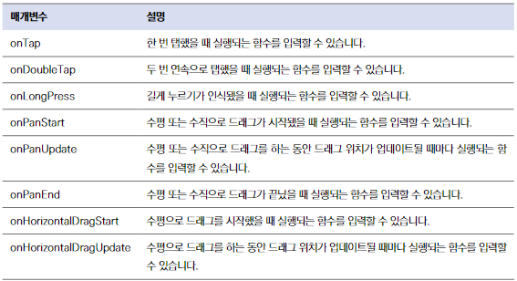
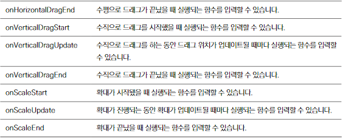

# 포토 스티커
## 사전 지식
### GestureDetector 와 제스처

## 레이아웃 구상
### 홈스크린 위젯
- 이미지 선택 전
    - 화면 중앙 이미지 선택하기 버튼
- 이미지 선택 후
    - AppBar
        - 반투명 형태
        - AppBar 위젯이 아닌 Container 로 구현
    - Body
        - 화면 전체 차지
        - 전체 화면 위에 AppBar 와 Footer 위젯
    - Footer
        - 꾸밀 이미지를 선택했을 때만 보임
        - 스티커 목록
        - 좌우 스크롤 가능
        - 스티커 탭 했을때 이미지 위에 표현

## 구현하기
### AppBar
- main_app_bar.dart
    - 이미지 선택 버튼
    - 스티커 삭제 버튼
    - 이미지 저장 버튼
- 앱바를 HomeScreen 위젯에 배치
    - StackFit
        - loose : 자식들이 최소한의 크기만 차지
        - expand : 자식들이 차지할 수 있는 공간의 최대한의 크기를 차지

### 이미지 선택하기
- 상태관리를 위해 StatefulWidget 으로 변경
- ImagePicker 플러그인 사용

### Body
- 이미지 선택여부에 따라 두가지 UI 랜더링
- InteractiveViewer - 위젯을 확대하고 좌우로 이동 할 수 있음
    - Image 위젯에 제스처 기능을 적용

### Footer
- SingleChildScrollView 
    - 가로로 스크롤 설정
- 각 스티커가 누릴 때 마다 실행할 OnEmoticonTap() 함수를 정의
    - GestureDetector, onTab
        - onEmotioncTap 함수 실행
        - 몇 번째 이모티콘이 탭 됐는지 상위 위젯으로 전달
    
### EmoticonSticker 위젯
- 이모티콘 탭하면 이미지 위에 선택한 이모티콘이 올려짐
    - 드래그나 크기 변경시 화면에 반영
- 확대/축소 제스처가 끝나는 순간의 배율을 기억
    - 새로 제스처가 감지될 때 반환되는 배율과 이 배율을 곱함
    - 위젯의 실제 초기 크기 대비 배율 계산
- Transform 위젯으로 자식 위젯의 위치 및 확대/축소 배율 변경 가능
    - transform 매개변수에 매트릭스 값을 넣어서 자식 위젯의 변화를 정의
    - 좌우, 상하 움직임을 translate() 함수로 정의
    - 확대, 축소를 scale() 함수로 정의

### 스티커 붙이기
- 각 스티커 관리를 위해 StickerModel 클래스를 구현
- id 값이 같은 인스턴스는 같은 스티커
- 화면에 붙여줄 스티커는 Set<StickerModel> 로 관리
- Footer 위젯에서 스티커를 누를 때마다 stickers 변수 업데이트

### 스티커 삭제하기
- 현재 스티커 컬렉션에서 selectedID와 일치하지 않는 스티커만 필터링해 set

### 이미지 저장하기
- RepaintBoundary 위젯
    - 위젯을 이미지로 추출 후 갤러리에 저장
    - 글로벌 key를 설정해 주고 추출할 위젯을 RepaintBoundary로 감싸서 추출
- ImageGallerySaver 로 갤러리에 이미지 저장
    - 이미지를 바이트 데이터로 변환한 후 저장
    - 바이트 데이터가 8비트 정수형으로 변환되어 있는걸 요구