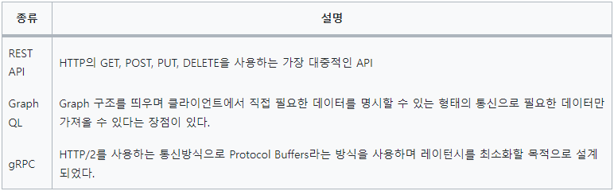

# 앱을 만들며 유용한 기능 익히기
## 16. 코팩튜브 
- 구글 유투브 API 를 사용해서 코드팩토리 유튜브 채널의 영상들을 보여주는 앱을 만든다
### 16.1 사전지식
#### 16.1.1 HTTP 기반 API 종류
- GET : 서버로부터 데이터를 가져온다
- POST : 데이터를 서버에 저장한다
- PUT : 데이터를 업데이트 한다
- DELETE : 데이터를 삭제한다
- PUT 은 리소스의 모든 것을 업데이트 할 때 사용하고 PATCH 는 리소스의 일부를 업데이트 할 때 사용한다

#### 16.1.2 Dio 플러그인
- 플러터에서 일반적으로 http 플러그인이나 dio 플러그인을 사용한다
### 16.2 사전 준비
#### 16.2.1 유튜브 API 설정하기
- 구글 클라우드 플랫폼에서 발급한 토큰이 필요
- 구글 클라우드 콘솔에 접속해서 YoutubeData API V3 를 검색 후 사용한다
#### 16.2.2 pubspec.yaml 설정하기
- youtube_player_flutter, dio 플러그인 설치

### 16.4 구현하기
- Http 요청의 응답을 받을 모델 클래스를 구현하고 이 모델 클래스를 가지고 CustomYoutubePlayer 를 만들어 UI 에 여러 개 뿌려준다. UI 를 작성한 다음 Dio 를 사용해서 직접 API 요청을 진행
#### VideoModel 구현하기
- 유투브 API 를 사용하여 동영상 ID 와 제목을 활용한다.
#### CustomYoutubePlayer 위젯
- 유투브 동영상을 재생할 수 있는 기능을 제공하는 역할
- YoutubePlayer 위젯을 조정하려면 YoutubePlayerController 위젯을 사용
#### YoutubeRepository 구현하기
- googleyoutubeapi 를 통해 채널 ID 를 이용해 동영상 리스트 정보를 받아아고 YoutubeRepository 에 저장
- getVideos() 사용 시 최신 영상 리스트 정보에서 필요한 정보만 뽑아 VideoModel 들을 List 로 만들어서 반환
#### ListView 구현
- home_screen 에 youtube_repository 가 반환하는 ListView 들을 보여줄 UI 를 구현
#### 새로고침 구현
- FutureBuilder 가 화면에 렌더링 될 때 future 매개변수에 입력된 함수가 실행된다
- 리스트를 아래로 당기는 동작을 추가하여 새로고침 되게 한다
