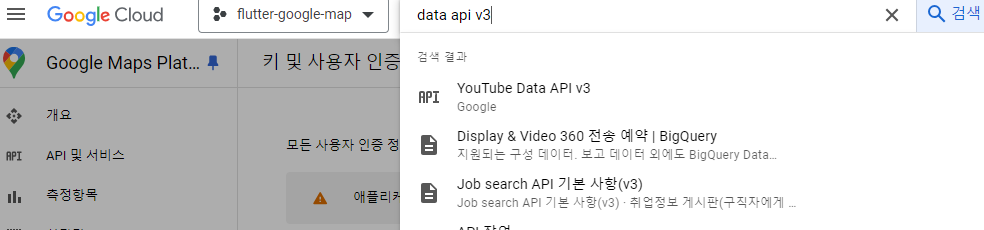

# 코팩튜브

## 사전지식
### HTTP 요청
- HTTP HyperText Transfer Protocol
    - 월드 와이드 웹 world wide web, www 상에서 통신할 수 있는 프로토콜(약속)
    - HTTP 문서를 주고받는 용도로 사용, TCP와 UDP 방식 사용
    - TCP : 연결 지향적 프로토콜, 신뢰성있는 데이터 전송 보장
        - 데이터 패킷 순서대로 전송, 손실 패킷 재전송
    - UDP : 비연결 지향적 프로토콜, 빠르고 간단한 데이터 전송 목표
        - 패킷 손실 복구 없음, 데이터 순서나 안전성 보장 없음
- HTTP는 요청 request 과 응답 response 로 구분


- HTTP 요청 URL 의 구조
    - protocol : http, https(보안 강화)
    - host : 요청 사이트 도메인
    - port
    - resource path : 요청 경로
    - query : 추가 전송 정보, map 형태


- HTTP 헤더
    - HTTP 요청에서 보내는 데이터에 대한 메타 정보를 입력

- API 종류
    - REST API
        - GET, POST, PUT, DELETE 등의 메서드를 사용해서 통신
        - HTTP를 이용해서 자원(Resource)을 명시하고 해당 자원에 대한 CRUD 연산 실시
        - 범용적인 API가 필요한 경우
    - GraphQL
        - Graph 구조
        - 클라이언트에서 직접 필요한 데이터를 명시할 수 있는 형태의 통신 방식
        - 필요한 데이터만 가져올 수 있음
        - Github
    - gRPC
        - HTTP/2 를 사용하는 통신 방식
        - Protocol Buffers 라는 방식 사용
        - 레이턴시를 최소화 할 목적
        - IoT


- HTTP 요청 메서드
    - GET : 서버로부터 데이터를 가져옴
        - HTML 문서의 body를 사용하지 않고 데이터를 전송할 필요가 있을 때 쿼리 매개변수 사용
    - POST : 데이터를 서버에 저장
        - body를 자주 사용하는 요청
        - 생성할 데이터에 대한 정보를 HTML 문서의 body에 입력
    - PUT : 데이터를 업데이트
        - 쿼리 매개변수와 body 사용
    - DELETE : 데이터 삭제

### REST API
- REST 기준을 따르는 HTTP API
    - REST : 월드 와이드 웹과 같은 분산 하이퍼미디어 시스템을 위한 소프트웨어 아키텍쳐 형식
- 균일한 인터페이스, 무상태, 계층화, 캐시 원칙을 준수하는 HTTP API : RESTful API
- 균일한 인터페이스 : 요청은 균일한 인터페이스를 가짐
    - 요청만으로도 어떤 리소스를 접근하려는지 알 수 있어야 함
- 무상태 : 요청이 완전 분리될 수 있어야 함
    - 하나의 요청이 이전 또는 이후의 요청과 완전 독립된 형태로 구현
- 계층화된 시스템 : 클라이언트와 서버 사이에 다른 중개자에 요청을 연결 할 수 있음
    - 또다른 서버가 될 수 있고 클라이언트에서는 이 계층이 보이지 않음
- 캐시 : 클라이언트는 응답 속도를 개선할 목적으로 일부 리소스를 저장할 수 있음
    - 공통 이미지나 헤더에 대해 해당 요청을 캐싱함으로 응답속도 향상, 불필요 요청 줄임
    - 캐시 불가능 API 지정 가능


- 플러터에서는 일반적으로 http 플러그인이나 dio 플러그인을 사용
```dart
import 'package:dio/dio.dart';

void main() async {
  final getResp = Dio().get('http://test.codefactory.ai');
  final postResp = Dio().post('http://test.codefactory.ai');
  final putResp = Dio().put('http://test.codefactory.ai');
  final deleteResp = Dio().delete('http://test.codefactory.ai');

}

```

### JSON
- HTTP 요청에서 body 구성의 구조는 크게 XML 과 JSON 으로 나뉨
- JSON : 키-값 쌍으로 이루어진 데이터 객체를 전달하는 개방형 표준 포맷
```dart
{
    'name': 'Code Factory',
    'languages': ['Javascript', 'Dart'],
    'age': 2
}
```
- List 사용 가능
- REST API 요청 및 응답 Body 에 JSON 구조를 자주 사용
- 플러터에서 직렬화serialization 을 통해 클래스의 인스턴스로 변환하여 사용

## 사전 준비
### 유투브 API 설정



### pubspec.yaml 설정
```dart
youtube_player_flutter: 9.0.1
dio: 5.4.3+1
```

### 인터넷 권한 설정
- android\app\src\main\AndroidManifest.xml
```dart
<uses-permission android:name="android.permission.INTERNET"/>
```

## 레이아웃 구상
- HomeScreen 단일 사용
    - AppBar
    - 동영상리스트
        - 동영상
        - 동영상 제목


## 구현하기
### VideoModel 구현하기
- 동영상 ID 와 제목만 담은 VideoModel 클래스 구현
- lib/model/video_model.dart

### CustomYoutubePlayer 위젯
- CustomYoutubePlayer StatefulWidget 생성
    - VideoModel 타입의 변수를 HomeScreen 에서 입력 받고 이 정보를 기반으로 UI 구현
    - lib/component/custom_youtube_player.dart
- YoutubePlayer 위젯
    - youtube_player_flutter 플러그인
    - 컨트롤러 사용
    - initState() 초기화 및 dispose() 폐기
- Coulumn 위젯으로 YoutubePlayer 위젯과 Text 위젯으로 동영상과 제목 UI 구성

### YoutubeRepository 구현
- lib/const_api.dart
    - 구글키, 유투브 주소 및 채널 ID 지정
- Search:list API 사용
    - https://developers.google.com/youtube/v3/docs/search/list?hl=ko
    - key : 구글 클라우드 콘솔 발급 받은 키
    - part : 어떤 정보를 불러올지 
        - snippet : 동영상 정보를 불러올 때 썸네일과 ID 등 다수의 정보 추가
    - channelid : 동영상 불러올 채널 ID
    - maxResult : 최대로 가져올 결과값 개수
    - JSON 데이터 리턴

``` dart
{
  "kind": "youtube#searchListResponse",
  "etag": "uaEFgKmblM7vfO0k9Vx54LSHMXQ",
  "nextPageToken": "CAUQAA",
  "regionCode": "KR",
  "pageInfo": {
    "totalResults": 146,
    "resultsPerPage": 5
  },
  "items": [
    {
      "kind": "youtube#searchResult", //요청 종류
      "etag": "AHcgQaZY6j3GhWOw8lmlD3XPMmw", // 데이터 변경 확인용
      "id": {   // 동영상 정보
        "kind": "youtube#playlist",
        "playlistId": "PLmEhRs1HB7RH5bMp-EZaO8kEqsX5HG80y" //동영상 ID
      },
      "snippet": {
        "publishedAt": "2022-03-24T03:50:20Z",  //출시일
        "channelId": "UCxZ2AlaT0hOmxzZVbF_j_Sw",    //채널 ID
        "title": "Shorts",  //타이틀
        "description": "",
        "thumbnails": {
          "default": {
            "url": "https://i.ytimg.com/vi/eQYDezwh2XE/default.jpg",
            "width": 120,
            "height": 90
          },
          "medium": {
            "url": "https://i.ytimg.com/vi/eQYDezwh2XE/mqdefault.jpg",
            "width": 320,
            "height": 180
          },
          "high": {
            "url": "https://i.ytimg.com/vi/eQYDezwh2XE/hqdefault.jpg",
            "width": 480,
            "height": 360
          }
        },
        "channelTitle": "코드팩토리",
        "liveBroadcastContent": "none",
        "publishTime": "2022-03-24T03:50:20Z"
      }
    },
  
  ]
}
```
- VideoModel id : item['id']['videoId']
- VideoModel title : itme['snippet']['title']
- dio 패키지 Dio 클래스
    - get(), post(), put(), delete() 제공, 같은 이름의 HTTP 요청 기능 수행
    - 모든 HTTP 요청은 네트워크를 통해 전송
    - 언제 응답이 도착할지 모르기 때문에 비동기 프로그래밍
- JSON 결과값 => List<VideoModel> 로 전환
    - items 의 리스트 값 중 videoId 나 title 이 없는 경우 제외

### ListView 구현하기
- 여러 위젯을 리스트로 구현하는 위젯
- getVideos() 함수로 비동기로 데이터 가져옴
- FutureBuilder 사용

### 새로고침 기능 구현
- RefreshIndicator 위젯은 새로고침 기능을 제공
    - 기능을 추가할 ListView 위젯을 감싸줌
- onRefresh 매개변수로 새로 고침때 특정 함수 실횅
    - setState() 함수로 build() 재실행