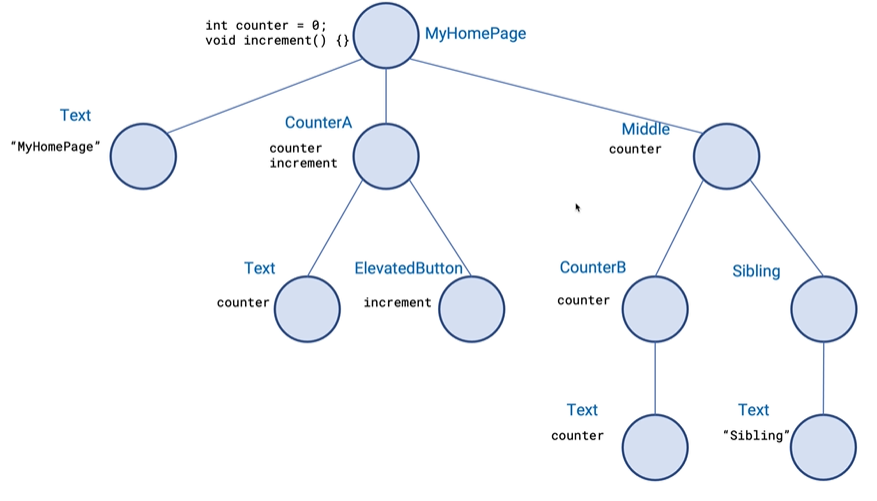

# 일정관리 앱

## 사전지식

### 상태관리
1. 클래스 내부에서의 상태 관리
    - StatefuleWidget
        - `setState()`를 호출 하여 상태 업데이트를 함.
        - 프로젝트가 커질수록 테이터 관리가 어려움.

        <video width="320" controls>
            <source src="2024-07-02_163238.mp4" type="video/mp4">
        </video>

        

2. 글로벌 상태관리
    

    - 상태관리 플러그인 종류
        - **GetX** : 단순하며, 직관적이고 강력한 의존성 관리와 상태 관리를 제공합니다. 가볍고 빠르며, 추가 구성없이 사용할 수 있습니다.
        - **Provider**: Flutter 팀에서 공식적으로 추천하는 상태 관리 솔루션이며 쉽게 사용할 수 있도록 설계되었습니다. 변경에 대해 리액션하는 것을 좋아한다면 이것을 선호할 수 있습니다.
        - **Riverpod**: Provider의 저자가 만든 라이브러리로, Provider의 한계를 극복하기 위해 만들어졌습니다. 이는 더 유연하며 안전성을 강화하였습니다.
        - **BLoC (Business Logic Component)**: Flutter에서 가장 널리 사용되는 패턴 중 하나입니다. 이것은 UI와 비즈니스 로직을 분리하여 코드 재사용성과 테스트 용이성을 증가시킵니다.

### 캐시와 긍정적 응답
1. 캐싱: 서버와 데이터를 주고 받는 시간동안 사용자는 '앱이 느리다'라는 느낌을 받을 수 있음. 이러한 문제점을 해결 하기 위해 캐싱이라는 기법을 사용함.

## 실습

### `node.js` 설치 및 실행하기
