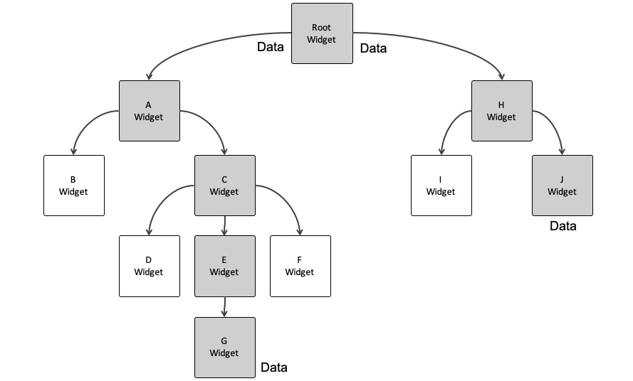

# Chapter 19. 서버와 연동하기
## 사전지식
### 상태 관리 (state management)
- StatefulWidget의 setState() 함수를 이용한 상태관리

- 상태관리 플러그인 (BloC,GetX,RiverPod) Provider로 상태관리 


### 캐시와 긍정적 응답
- 기존에 기억하던 데이터를 보여주는 기능
- 요청을 보내기전 응답이 성공적이라고 예측하여 입력한 값으로 미리 캐시를 업데이트. 
 
## 사전준비
### Node.js 설치 및 실행
- calender_scheduler_server 프로젝트 로드
- www.nodejs.org 에서 Node.js 파일 설치
- 터미널에서 node --version, npm install, npm run start:dev 실행
- http://localhost:3000/api 으로 확인


 
## schedule_model 구현
```dart
class ScheduleModel {

  final String id;
  final String content;
  final DateTime date;
  final int startTime;
  final int endTime;

  ScheduleModel({
    required this.id, required this.content, required this.date, required this.startTime, required this.endTime
    });

  //json으로 모델 생성
  ScheduleModel.fromJson({
    required Map<String, dynamic> json,
}) : id = json["id"],
     content = json["content"],
     date = DateTime.parse(json["date"]),
     startTime = json["startTime"],
     endTime = json["endTime"];

  //모델에서 json 생성
   Map<String,dynamic> toJson(){
     return {
       "id": id,
       "content":content,
       "date": "${date.year}${date.month.toString().padLeft(2,"0")}${date.day.toString().padLeft(2,"0")}",
       "startTime" : startTime,
       "endTime" : endTime,
     };
   }

   //copywith를 사용하여 특정 속성만 변환해서 새로 생성
   ScheduleModel copyWith({
    String? id,
    String? content,
    DateTime? date,
    int? startTime,
    int? endTime,
}) {
     return ScheduleModel(
       id: id ?? this.id,
       content: content ?? this.content,
       date : date ?? this.date,
       startTime: startTime ?? this.startTime,
       endTime: endTime ?? this.endTime
     );
   }

}

```

## schedule_repository 구현
```dart
import 'dart:async';
import 'dart:io';

import 'package:calendar_schedule/model/schedule_model.dart';
import 'package:dio/dio.dart';

class ScheduleRepository {

  final _dio = Dio();
  //서버 url이 안드로이드내부 인지
  final _targetUrl = "http://${Platform.isAndroid ? "10.0.2.2" : "localhost"}:3000/schedule";

//조회
  Future<List<ScheduleModel>> getSchedules({
    required DateTime date,
}) async {
    final resp = await _dio.get(
      _targetUrl,
     queryParameters: {
       "date": "${date.year}${date.month.toString().padLeft(2, "0")}${date.day.toString().padLeft(2, "0")}"
     });

    //모델 인스턴스로 매핑
    return resp.data.map<ScheduleModel>((x)=>ScheduleModel.fromJson(json: x,),).toList();
  }

  //생성
  Future<String> createSchedule({
    required ScheduleModel schedule,
  }) async {
    final json = schedule.toJson(); //json으로 변환해서 보냄

    final resp = await _dio.post(_targetUrl, data: json);

    return resp.data?["id"];
  }

  //삭제
  Future<String> deleteSchedule({
     required String id,
  }) async {
    final json = await _dio.delete(_targetUrl, data: {"id":id});

    return json.data?["id"];
  }

}
```
## schedule_provider 구현
```dart

import 'package:flutter/material.dart';
import 'package:calendar_schedule/model/schedule_model.dart';
import 'package:calendar_schedule/repository/schedule_repository.dart';
import 'package:uuid/uuid.dart';


class ScheduleProvider extends ChangeNotifier {

  //API 요청 클래스
  final ScheduleRepository repository;

  DateTime selectedDate = DateTime.utc(
    DateTime.now().year,
    DateTime.now().month,
    DateTime.now().day
  );


  Map<DateTime, List<ScheduleModel>> cache = {}; //일정 정보 저장

 ScheduleProvider({
  required  this.repository,
}) : super() {
   getSchdules(date:selectedDate);
 }

 //일정 조회
 void getSchdules({required DateTime date}) async {
   final resp = await repository.getSchedules(date: date);

   cache.update(date,(v)=> resp, ifAbsent: ()=> resp);

   notifyListeners(); //참조하는 모든 위젯들의 bulid 함수 재실행
 }

 //일정 추가
 void createSchduels({
    required ScheduleModel schedule,
}) async {

   final targetDate = schedule.date;

   final uuid = Uuid();
   final tempId = uuid.v4();
   final newSchedule = schedule.copyWith(id: tempId,);

   //서버에서 응답받기 전 캐시를 먼저 업데이트
   cache.update(
       targetDate,
       (v)=> [
         ...v,
         newSchedule,]..sort((a,b)=> a.startTime.compareTo(b.startTime,),
   ),
   ifAbsent: () => [newSchedule],
   );

   //업데이트 반영
   notifyListeners();

   try{

     final savedSchedule = await repository.createSchedule(schedule: schedule);

     //실제 서버에서 받아온 후 업데이트
     cache.update(
         targetDate,
         (v)=>v.map((e)=> e.id == tempId ? e.copyWith(id: savedSchedule,):e).toList(),);
   }catch(e) {

     //실패하면 캐시에서 삭제
    cache.update(targetDate,
        (v)=> v.where((e)=>e.id!=tempId).toList(),
    );

   }
   //업데이트 반영
   notifyListeners();
 }

 //일정 삭제
 void deleteSchedule({
    required DateTime date,
    required String id,
}) async {

   //삭제할 일정 기억
   final targetSchedule = cache[date]!.firstWhere((e)=>e.id == id);

   //캐시에서 미리 삭제
   cache.update(
     date,
         (v) => v.where((e) => e.id != id).toList(),
     ifAbsent: () => [],);

   //캐시 업데이트
   notifyListeners();

   try{
     //서버에서 삭제
     await repository.deleteSchedule(id: id);
   }
   catch(e){
     //삭제 실패시
     cache.update(date,
         (v)=>[...v,targetSchedule]..sort((a,b)=> a.startTime.compareTo(b.startTime,
         ),
         ),
     );
   }

         //캐시 업데이트
         notifyListeners();

 }

 //선택 일자 변경
 void changeSelectedDate({
    required DateTime date,
}) {
   selectedDate = date;
   notifyListeners();
 }

}
```

## main 구현
```dart
import 'package:calendar_schedule/screen/home_screen.dart';
import 'package:flutter/material.dart';
import 'package:intl/date_symbol_data_local.dart';
import 'package:calendar_schedule/database/drift_database.dart';
import 'package:get_it/get_it.dart';

import 'package:provider/provider.dart';
import 'package:calendar_schedule/repository/schedule_repository.dart';
import 'package:calendar_schedule/provider/schedule_provider.dart';

void main() async {
  WidgetsFlutterBinding.ensureInitialized();
  await initializeDateFormatting();

  //db 선언
  final database = LocalDatabase();

  //database를 전역 선언
  GetIt.I.registerSingleton<LocalDatabase>(database);

  final repository = ScheduleRepository();
  final schduleProvider = ScheduleProvider(repository: repository);

  runApp(
    ChangeNotifierProvider(create: (_) => schduleProvider,
    child: MaterialApp(
      debugShowCheckedModeBanner: false,
      home: HomeScreen(),
    ) ,
    ),
  );
}
```
##

## home_screen 구현
```dart
 import 'package:calendar_schedule/component/today_banner.dart';
import 'package:flutter/material.dart';
import 'package:calendar_schedule/component/main_calendar.dart';
import 'package:calendar_schedule/const/colors.dart';
import 'package:calendar_schedule/component/schedule_card.dart';
import 'package:calendar_schedule/component/schedule_bottom_sheet.dart';
import 'package:get_it/get_it.dart';
import 'package:calendar_schedule/database/drift_database.dart';
import 'package:path/path.dart';

import 'package:provider/provider.dart';
import 'package:calendar_schedule/provider/schedule_provider.dart';

/*
class HomeScreen extends StatefulWidget {
  const HomeScreen({super.key});

  @override
  State<HomeScreen> createState() => _HomeScreenState();
}

class _HomeScreenState extends State<HomeScreen>{
*/

class HomeScreen extends StatelessWidget{
  //선택된 날짜를 관리
  DateTime selectedDate = DateTime.utc(DateTime.now().year, DateTime.now().month, DateTime.now().day);

  @override
  Widget build(BuildContext context) {

    //프로바이더 변경이 있으면 다시 build 함수 실행
    //provider 패키지를 불러와야함.
    final provier = context.watch<ScheduleProvider>();
    final selectDate = provier.selectedDate;
    final schedules = provier.cache[selectedDate] ?? [];

    return Scaffold(
      floatingActionButton: FloatingActionButton( //플로팅 액션버튼 생성
        backgroundColor: PRIMARY_COLOR,
        onPressed: (){
          showModalBottomSheet(
              context: context,
              isScrollControlled: true,
              builder: (_)=>ScheduleBottomSheet(
                selectedDate: selectDate,
              ),//bottomsheet
             isDismissible: true //배경선택시 닫기
          );
        },
        child: Icon(Icons.add),
      ),

        body: SafeArea(
            child: Column(
              children: [
                MainCalendar(
                  selectedDate: selectDate,
                  onDaySelected: (selectDate, focusedDate) => onDaySelected(selectDate,focusedDate,context),
                ),
                SizedBox(height: 8,),
                /*
                StreamBuilder<List<Schedule>>(
                    stream: GetIt.I<LocalDatabase>().watchSchedules(selectedDate),
                    builder: (context, snapshot){
                      return TodayBanner(
                          selectedDate: selectedDate,
                          count: snapshot.data?.length ?? 0);
                    }),*/
                TodayBanner(selectedDate: selectDate, count: schedules.length),
                SizedBox(height: 8,),
                /*
                Expanded(
                    child: StreamBuilder<List<Schedule>>(
                      //데이터 조회
                      stream: GetIt.I<LocalDatabase>().watchSchedules(selectedDate),
                      builder: (context, snapshot){
                        if(!snapshot.hasData){ //데이터가 없을때 빈 컨테이너
                          return Container();
                        }
                        return ListView.builder(
                            itemCount: snapshot.data!.length, //리스트에 보여질 갯수
                            itemBuilder:(context, index){
                              final schedule = snapshot.data![index]; //현재 인덱스에 해당되는..
                              return Dismissible( //옆으로 밀어서 삭제
                                  key: ObjectKey(schedule.id), //유니크한 키값
                                  direction: DismissDirection.startToEnd, //왼쪽에서 오른쪽 밀기
                                  onDismissed: (DismissDirection direction) { //밀었을때 삭제 쿼리실행
                                    GetIt.I<LocalDatabase>().removeSchedule(schedule.id);
                                  },
                                  child:
                                  Padding(
                                    padding: const EdgeInsets.only(bottom: 8,left: 8,right: 8),
                                    child: ScheduleCard( //ScheduleCard 위젯에 화면에 나타낼 데이터 전달
                                        startTime: schedule.startTime,
                                        endTime: schedule.endTime,
                                        content: schedule.content),
                                  )
                                  );
                            });
                      },
                    ),
                ),*/
                Expanded(
                    child: ListView.builder(
                      itemCount: schedules.length,
                      itemBuilder:(context, index){
                        final schedule = schedules[index];

                        return Dismissible( //옆으로 밀어서 삭제
                        key: ObjectKey(schedule.id), //유니크한 키값
                        direction: DismissDirection.startToEnd, //왼쪽에서 오른쪽 밀기
                        onDismissed: (DismissDirection direction) { //밀었을때 삭제 쿼리실행
                         provier.deleteSchedule(date: selectDate, id: schedule.id);
                        },
                        child:
                        Padding(
                        padding: const EdgeInsets.only(bottom: 8,left: 8,right: 8),
                        child: ScheduleCard( //ScheduleCard 위젯에 화면에 나타낼 데이터 전달
                        startTime: schedule.startTime,
                        endTime: schedule.endTime,
                        content: schedule.content),
                        )
                        );

                      })
                ),
              ],
            )
        )
    );
  }

  void onDaySelected(DateTime selectedDate, DateTime focusedDate, BuildContext context)
  {

    /*
    setState(() {
      this.selectedDate = selectedDate;
    });
     */

    final provier = context.read<ScheduleProvider>();
    provier.changeSelectedDate(date: selectedDate,);
    provier.getSchdules(date: selectedDate);
  }

}
```
 
