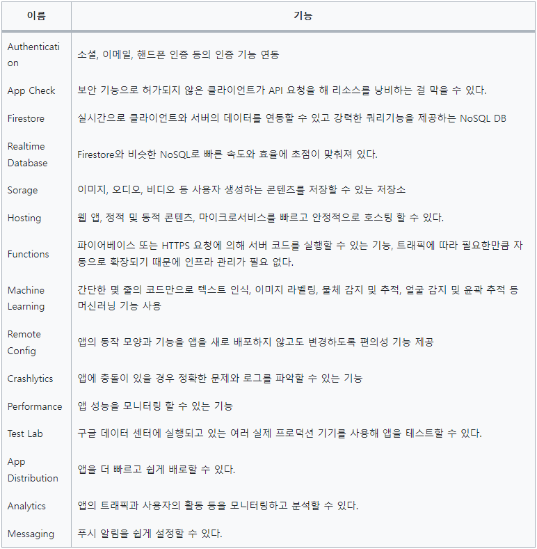
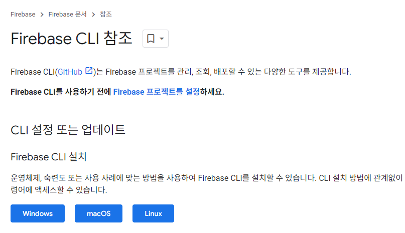
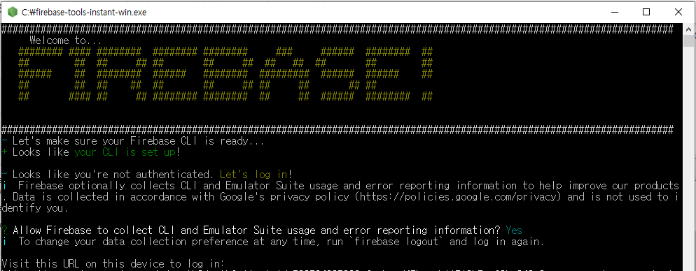
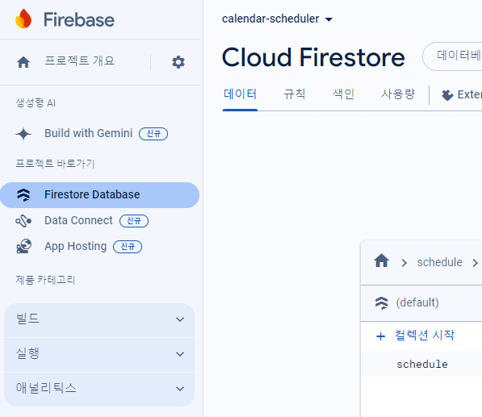

# 앱을 만들며 유용한 기능 익히기
## 20. 파이어베이스 연동하기
- 파이어스토어를 사용해서 일정 관리 앱의 데이터를 다룬다
### 20.1 사전지식
- 파이어베이스
  - 구글이 소유하고 있는 모바일 애플리케이션 개발 플랫폼
  - 앱을 개발하고, 개선하고, 키워갈수 있는 도구 모음
- 이번 장에는 데이터베이스 기능인 파이어스토어만 사용


#### 20.1.2 파이어스토어
- NoSQL 데이터베이스
- 컬렉션(테이블) 내에 문서(열)을 저장하고 Key-value 구조로 데이터를 저장하는 방식
- JSON 구조로 저장할 수 있다

```dart
  {
    "name" : "코드팩토리",
    "age" : 31,
    "favoriteFoods" : ["치킨", "피자", "라면"]
  }
```
- 파이어스토어 문서 삽입
  - add() 함수 사용
    - 자동으로 ID 값 생성
      ```dart
        FirebaseFirestore.instance
          .collection('person')
          .add(data);
      ```
  - set() 함수 사용
    - doc() 에 ID 값 지정
      ```dart
        FirebaseFirestore.instance
          .collection('person')
          .doc('1')
          .set(data);
      ```
- 파이어스토어 문서 삭제
  - delete() 함수 사용
      ```dart
        FirebaseFirestore.instance
          .collection('person')
          .doc('1')
          .delete();
      ```
- 파이어스토어 문서 조회
  - 데이터 변경될 때마다 실시간 반영, snapshots()
      ```dart
        FirebaseFirestore.instance
          .collection('person')
          .snapshots();          
      ```
  - 일회성으로 데이터 가져오기, get()
      ```dart
        FirebaseFirestore.instance
          .collection('person')
          .get();          
      ```
- 파이어스토어 문서 업데이트
  - update() 함수 사용
      ```dart
        FirebaseFirestore.instance
          .collection('person')
          .doc('1')
          .update({
            'name' : '골든래빗', 
          });
      ```
### 20.2 사전준비
#### 20.2.1 pubspec.yaml 파일 설정하기

#### 20.2.3 파이어베이스 CLI 설치 및 로그인 하기
- 파이어베이스 CLI 설치
  - `https://firebase.google.com/docs/cli?hl=ko#install-cli-windows`





#### 20.2.4 프로젝트에 파이어베이스 설정하기

- FlutterFire CLI 설치
  - terminal > `dart pub global activate flutterfire_cli`
- 파이어베이스 콘솔 접속
  - `https://console.firebase.google.com`
  - 콘솔 상에서 calendar-scheduler 프로젝트 생성
  - 파이어베이스 프로젝트를 플러터 프로젝트에 적용
    - terminal > `flutterfire configure -p <프로젝트 ID>`

#### 20.2.5 파이어스토어 데이터베이스 생성하기
- 파이어스토어 : 구글에서 모든 인프라와 SDK 를 관리해주는 NoSQL 데이터베이스



### 20.3 구현하기
#### 20.3.1 파이어베이스 설정 추가하기
- Firebase.initializeApp() : Firebase 초기화
- DefaultFirebaseOption.currentPlatform
  - /lib/firebase_option.dart 에 설정된 값을 플러터 프로젝트에 설정

```dart
  await Firebase.initializeApp(
    options: DefaultFirebaseOptions.currentPlatform,
  );
```
#### 20.3.2 일정 데이터 삽입하기
- lib/component/schedule_bottom_sheet.dart
```dart
  void onSavePressed(BuildContext context) async {
    if (formKey.currentState!.validate()) {
      formKey.currentState!.save();

      // ScheduleModel 생성
      final schedule = ScheduleModel(
        id: const Uuid().v4(),
        content: content!,
        date: widget.selectedDate,
        startTime: startTime!,
        endTime: endTime!,
      );

      // ScheduleModel 파이어스토어에 삽입
      await FirebaseFirestore.instance
          .collection(
            'schedule',
          )
          .doc(schedule.id)
          .set(schedule.toJson());
```
#### 20.3.3 일정 데이터 조회하기
- Provider 제거
- HomeScreen 을 StatefulWidget 으로 변경

#### 20.3.4 일정 데이터 삭제하기
- lib/screen/home_screen.dart
```dart
  return Dismissible(
      key: ObjectKey(schedule.id),
      direction: DismissDirection.startToEnd,
      onDismissed: (DismissDirection direction) {
        FirebaseFirestore.instance
            .collection('schedule')
            .doc(schedule.id)
            .delete();
  },
```

