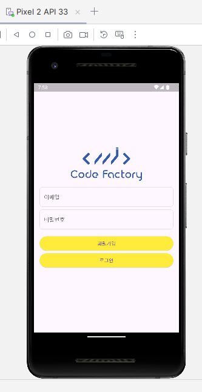

# 실전! 일정 관리 앱 개발 & 인증 & 배포하기
## 21. JWT 를 이용한 인증하기 
- JWT 를 이용해서 회원가입을 하고 로그인하는 인증 방식을 구현해본다

### JWT
- JSON Web Token
- 인증과 정보 교환을 위한 업계 표준
- 클라이언트와 서버 간의 안전한 방식으로 정보를 전송하기 위해 사용
- JSON 형식으로 표현되며, 클레임이라고 불리는 정보를 포함하고 서명을 통해 검증된다
#### JWT 구조
- JWT 토큰은 점(.)을 기준으로 세 가지 부분으로 구성한다
- Header
  - 토큰의 유형과 해싱 알고리즘을 포함한다
- Payload
  - 토큰에 담기는 클레임 정보를 포함한다
  - 클레임은 토큰에 저장될 사용자 정보, 권한, 만료일 등을 의미한다
- Signature
  - 헤더, 페이로드 및 비밀 키를 사용하여 생성한다
#### Access Token
- 사용자의 인증과 자원에 대한 접근을 위한 토큰
- 사용자가 로그인을 성공하면, 서버는 해당 사용자에게 Access Token 을 발급한다
- Access Token 은 클라이언트 측에서 안전한 저장소에 저장되어 인증된 요청 시 헤더에 포함되어 서버에 전달된다
- 주로 짧은 유효 기간을 가지며, 만료되면 다시 인증을 거쳐야 한다
- 서버는 Access Token 을 검증하여 사용자의 신원을 확인하고 요청에 대한 권한을 부여한다
#### Refresh Toekn
- Access Token 의 갱신과 세션 관리를 위해 사용되는 토큰
- 사용자가 로그인을 성공하면, 서버는 함께 Refresh Token 을 발급한다
- Access Token 보다 긴 유효 기간을 가지며, 일반적으로 일주일 또는 한 달과 같은 기간으로 설정된다
- 클라이언트는 Refresh Token 을 안전한 저장소에 저장하여 보관한다
- Access Token 의 유효 기간이 만료되면, 클라이언트는 Refresh Token 을 사용하여 새로운 Access Token 을 서버에 요청한다
- 서버는 Refresh Token 의 유효성을 검증하고, 유효한 경우 새로운 Access Token 을 발급하여 클라이언트에게 전달한다
#### Refresh Token 과 Access Token 의 차이점
- 유효 기간 : Access Token 은 짧은 유효 기간을 가지고, Refresh Token 은 긴 유효 기간을 가진다
- 사용 용도 : Access Token 은 자원에 접근하기 위한 인증 정보로 사용, Refresh Token 은 Access Token 의 갱신과 세션 관리에 사용
- 저장 위치 : Access Token 은 클라이언트 측의 임시 저장소에, Refresh Token 은 안전한 저장소에 보관
- 발급 주체 : 서버가 사용자 인증에 성공하면, Access Token 과 Refresh Token 을 모두 발급한다
- 유효성 검증 : 서버는 Access Token 과 Refresh Token 을 각각 검증하며 사용자의 인증과 권한을 확인한다

