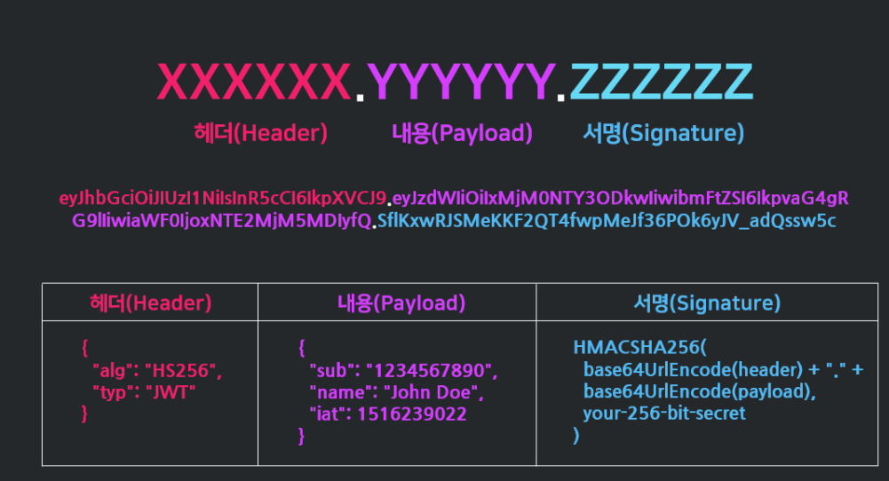
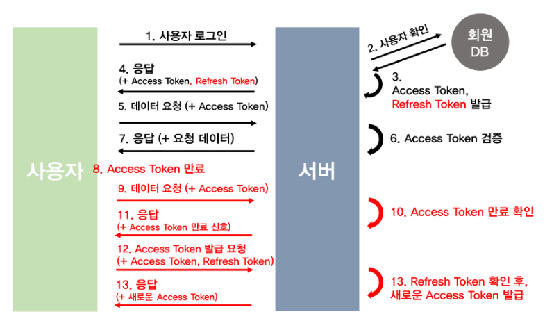

# 일정관리 - JWT를 사용한 인증
## 사전지식
### 인증authentication
- 서버와 통신하는 사용자의 정보와 유효성을 검증하는 기능
- 인증의 필요성 
    - 18장 드리프트 플러그인
        - 로컬 데이터베이스 사용(사용자 핸드폰)
        - 사용자앱과 1:1 매핑 이므로 인증 불필요
    - 서버에 연결
        - 모든 사용자와 일정데이터 공유
        - 본인 생성 일정뿐 아니라 타인이 생성한 일정도 응답받게 됨
    - 각 기기에 로그인한 사용자별로 구분해서 본인 생성 일정만 반환 하는게 올바른 형태

### JWT(JSON Web Token)
- 인증에 필요한 정보들을 암호화 시킨 JSON 토큰
- JWT 기반 인증은 JWT 토큰(Access Token)을 HTTP 헤더에 실어 서버가 클라이언트를 식별하는 방식
- JSON 데이터를 Base64 URL-safe Encode 를 통해 인코딩하여 직렬화한 것
    - 토큰 내부에는 위변조 방지를 위해 개인키를 통한 전자서명도 들어있음
- '.' 을 구분자로 나누어지는 세가지 문자열의 조합
    - 헤더 : 토큰에 대한 정보, 토큰 시그니처가 어떤 알고리즘으로 암호화 됐는지, 타입이 무엇인지      
    - 페이로드 : 데이터베이스상의 사용자 ID, 이름, 토큰 만료 기간 등 사용자 정보
    - 시그니처 : JWT 의 유효성을 검증할 수 있는 정보
        - (헤더 + 페이로드)와 서버가 갖고 있는 유일한 key 값을 합친 것을 헤더에서 정의한 알고리즘으로 암호화
        - 시그니처는 서버에서 관리하는 비밀키가 유출되지 않는 이상 복호화 불가능
        - JWT 가 탈취되도 secret 값을 몰라서 토큰 정보가 바뀌면 토큰 변형 여부로 위변조 확인
            - 토큰 생성 시 서버만 아는 secret 키를 조합해서 토큰 발행
            - => 클라이언트가 토큰을 보내면 서버는 헤더와 토큰 및 자신이 가진 키로 서명을 생성해 비교


### 엑세스 토큰과 리프레시 토큰
- 액세스 토큰access token : 보호된 정보에 접근할 수 있는 권한 부여에 사용
    - 서버에 인증 정보를 보내서 리소스를 가져오거나 변경, 생성, 삭제하는데 이용
    - 사용 빈도가 높아 탈취당할 가능성이 커서 토큰 자체의 유효기간을 짧게 지정
- 리프레시 토큰refresh token : 처음 로그인 때 액세스 토큰과 동시에 발급되는 토큰
    - 액세스 토큰의 유효기간이 만료됐을 때 재발급 받을 수 있도록 하는 특수한 토큰
    - 액세스 토큰을 폐기하고 새로운 액세스 토큰을 발급 받을 때 사용
    - 보통 데이터베이스에 유저 정보와 같이 기록
- 액세스 토큰은 발급된 이후 서버에 저장되지 않고 토큰 자체로 검증
    - 탈취되면 토큰 만료 전까지 누구나 권한 접근 가능
    - JWT 는 발급 후 삭제가 불가능 하므로 접근에 관여하는 토큰에 유효시간을 부여
    - 짧으면 로그인 자주해야하므로 불편, 길면 보안에 취약
    - 똑같은 JWT 인 리프레쉬 토큰을 발급하여 재발급에 사용

### JWT 이용한 인증 절차
- 사용자 로그인
    - 아이디와 비밀번호 서버로 전송, 'ID:PASSWORD' 형태 base64 인코딩
    - 헤더에 authorization:'Basic {인코딩된 결과}' 형태로 전송
    - 서버에서 base64 디코딩 후 아이디 비밀번호 검증
- 로그인 성공시 액세스 토큰과 리프레시 토큰을 동시 발행
    - 서버는 데이터베이스에 리프레시 토큰 저장
    - 클라이언트는 두 토큰을 쿠키, 세션 혹은 웹 스토리지에 저장
    - 요청이 있을때 헤더에 담아서 보냄
        - 엑세스 토큰을 authorization:'Bearer {토큰}' 형태로 포함해 API 요청
        - 엑세스 토큰 유효성 검증
    - 만료된 액세스 토큰 : 401 에러 응답
        - 리프레시 토큰을 포함하여 헤더에 authorization:'Bearer {토큰}' 입력해서 토큰 재발급 요청
        - 리프레시 토큰을 확인하여 새로운 엑세스 토큰 발급
        - 새로운 엑세스 토큰으로 다시 요청 후 응답
    - 사용자가 로그아웃하면 저장소에서 리프레시 토큰을 삭제
    - 다시 로그인 하면 서버에서 다시 리프레시 토큰을 재발급해서 DB 에 저장



- 일반적으로 토큰은 요청 헤더의 Authorization 필드에 담아서 보내짐
```Authorization: <type> <credentials>```
- 타입의 종류에 따라 토큰을 다르게 처리
    - Basic : 사용자 아이디와 암호를 Base64로 인코딩한 값을 토큰으로 사용
    - Bearer : JWT 혹은 OAuth 에 대한 토큰 사용
    - HOBA : 전자 서명 기반 인증
    - Mutual : 암호를 이용한 클라이언트-서버 상호 인증

### Session 대비 JWT 장점
    - 분산 시스템 적합 : 세션은 사용자 인증정보를 서버에 저장하는 방식
        - 여러 서버 사이에서 세션 정보 공유하는 분산 시스템에서 문제 발생 가능
        - JWT는 클라이언트 저장이라 해당 시스템에 적합
    - 세션은 사용자가 많을수록 서버의 부하가 증가
    - 모바일 환경 적합
    - 자체 포함 정보
    - 표준화된 형식

## 레이아웃 구상
### 회원가입/로그인 페이지
- 텍스트 필드로 이메일과 비밀번호 입력 받음
- 회원가입 버튼
- 로그인 버튼

## 사전준비
- 서버 프로젝트 다운로드 및 실행
- 플러터 템플릿 프로젝트 실행


## 구현하기
### 로그인 UI 구현하기
- pubspec.yaml : assets 추가
- auth_screen.dart 추가
    - UI 만들고 main.dart 에서 연결

### UI 디자인 개선
- 로고 색과 같은 색인 SECONDARY_COLOR 변수
- 텍스트필드 에러 표시 색깔 ERROR_COLOR 변수
- login_text_field.dart
    - 텍스트 필드 디자인
    - auth_screen 적용

### 인증 로직 구현하기
- AuthRepository : 인증 요청 관련 로직 담당
- ScheduleRepository : 일정 관련 요청을 담당
- ScheduleProvider : 상태 관리를 담당
    - AuthProvider를 추가하여 따로 관리하는게 효율적이지만 코드가 많아지는 관계로 생략
- AuthRepository
    - 인증 관련 로직 생성
        - 회원가입 요청
        - 로그인 로직 : base64로 인코딩해서 헤더로 보내줌
    - 리프레시 토큰과 액세스 토큰을 재발급 받는 요청
- ScheduleProvider 
    - authRepository 추가
    - updateTokens() 함수
        - 토큰을 새로 발급했을 때 refreshToken 프로퍼티와 accessToken 프로퍼티 업데이트
    - 회원가입 로직
        - authRepository 의 regster() 함수 실행 후 updateTokens() 함수 실행
    - 로그인 : 회원가입과 동일
    - 로그아웃 : 토큰들을 null 로 변환
    - rotateToken() : 리프레시 토큰과 엑세스 토큰을 재발급
- main 에서 ScheduleProvider를 인스턴스화 할때 AuthRepository 주입
- AuthScreen
    - Form 위젯
    - validate() 함수로 하위의 모든 TextFormField 의 validator() 함수를 실행하여 입력값 확인
    - TextFormField 상위 위젯인 Column을 Form으로 감싸고 key 입력
        - formKey의 validate() 함수를 실행하면 TextFormField 검증
        - save() 함수로 값 저장
    - 검증이 완료되면 ScheduleProvider 의 register(), login() 함수 실행
- today_banner
    - 로그아웃 아이콘 추가
    - 프로바이더 logout() 실행 후 AuthScreen 으로 돌아감

### 엑세스 토큰을 이용한 요청 구현하기
- 인증 확인 요청을 서버로 보냈을 때 어떤 사용자가 요청을 보냈는지 서버가 식별
- 모든 일정 정보 관련 요청에 엑세스 토큰을 추가해서 요청을 보냄
- ScheduleRepository 에서 각 함수에 보내는 HTTP 요청의 헤더에 토큰을 포함
- schedule_provider 에서 accessToken 프로퍼티 주입
- home_screen 을 stateful 로 바꾸고 로그인 시 오늘 날짜를 기본으로 선택