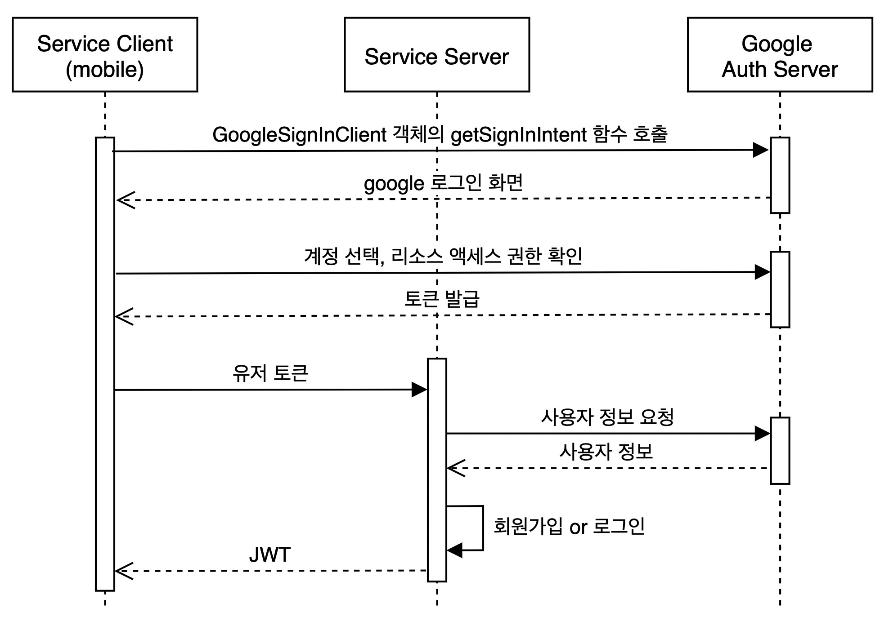

# 일정관리 앱

## 사전지식

### `소셜로그인`과 `OAuth2.0`

1. 소셜로그인을 사용하면 얻을 수 있는 이점

    - 서비스별로 다른 비밀번호를 기억할 필요 없음
    - 회원가입절차 생략 가능
    - 소셜서비스의 계정정보를 연동하기 때문에 가짜 계정 생성을 막을 수 있음
    - 내 서비스에서 직접적인 인증을 하지 않기 때문에 개발자가 리소스를 절약할 수 있음.
    - 앱의 사용자 경험을 증진 시킬 수 있음.

2. OAuth2.0 정차를 준수하는 소셜로그인

    - OAuth2.0 절차를 준수 함.
    - 다양한 프로바이더가 OAuth2.0의 약속된 방법을 준수하여 소셜로그인을 제공 하는것.
    - 내 서비스에서 소셜로그인을 적용하고 싶으면 OAuth2.0의 절차대로 로그인을 구현하면 됨.
    - 소셜로그인 적용방법
      - 프로바이더에 앱 등록
      - 앱 등록 시 인증코드를 받을 리다이렉트 URL을 등록 함.
      - 앱을 등록 하면 `Client ID`와 `Client Secret`코드를 발급 받음.
      - `Client ID`와 `Client Secret`코드를 이용하여 인증 요청을 진행.

3. 소셜로그인 진행방식 알아보기

    

### 파이어베이스인증

- 대부분의 소셜로그인 프로바이더는 `OAuth2.0` spec을 따르기 때문에 대부분이 비슷함.
- 하지만 각 소셜 로그인별로 제공하는 SDK의 사용법과 반환하는 값이 다르기 때문에 여러개를 각각 연동 하는 과정이 어려울 수 있음.
- `파이어베이스`, `Auth0`, `Okta`, `Supabase`등은 SDK를 제공하여 여러 소셜 로그인을 제공 함.