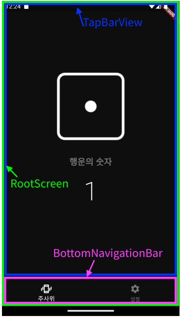

# 앱을 만들며 유용한 기능 익히기
## 11. 디지털 주사위
- 핸드폰을 흔들면 새로운 주사위를 뽑는 앱을 만들어본다


### 11.1 사전 지식
#### 11.1.1 가속도계
- 특정 물체가 특정 방향으로 이동하는 가속도가 어느 정도인지를 숫자로 측정하는 기기
- 대부분의 핸드폰에 가속도계가 장착되어 있다
- 3개의 축으로 가속도를 측정
  - x 축 : 좌우로 움직이는 방향
  - y 축 : 위아래로 움직이는 방향
  - z 축 : 앞뒤로 움직이는 방향
- 가속도계를 사용해 움직임 이벤트를 받으면 x, y, z 축의 측정 결과는 double로 반환
#### 11.1.2 자이로스코프
- 가속도계는 x, y, z 축으로의 직선 움직임만 측정
- 자이로스코프는 x, y, x 축의 회전을 측정할 수 있다
  - x 축 : 좌우로 회전하는 방향
  - y 축 : 위아래로 회전하는 방향
  - z 축 : 앞뒤로 회전하는 방향    
#### 11.1.3 Sensor_Plus 패키지
- Sensor_Plus 패키지를 사용하면 핸드폰의 가속도계와 자이로스코프 센서를 사용할 수 있다
- Shake 패키지
  - 핸드폰 움직임을 정규화하는 작업이 되어 있음
- sensors_plus 패키지 사용하는 예제
    ```dart
    import 'package:sensors_plus/sensors_plus.dart';
    // 생략

    // 중력을 반영한 가속도계 값
    accelerometerEvents.listen((AccelerometerEvent event) {
      print(event.x); // x축 수치
      print(event.y); // y축 수치
      print(event.z); // z축 수치
    });

    // 중력을 반영하지 않은 순수 사용자의 힘에 의한 가속도계 값
    userAccelerometerEvents.listen((UserAccelerometerEvent event) {
      print(event.x); // x축 수치
      print(event.y); // y축 수치
      print(event.z); // z축 수치
    });

    gyroscopeEvents.listen((GyroscopeEvent event) {
      print(event.x); // x축 수치
      print(event.y); // y축 수치
      print(event.z); // z축 수치
    });
    ```
### 11.2 사전 준비
#### 11.2.1 상수 추가하기
- Colors.grey 는 600 을 입력하면 런타임에 색상이 계산되기 때문에 const 가 아닌 final 로 선언
- lib/const/colors.dart
    ```dart
    import 'package:flutter/material.dart';

    const backgroundColor = Color(0xFF0E0E0E); // 배경색
    const primaryColor = Colors.white; // 주색상
    final secondaryColor = Colors.grey[600]; // 보조 색상
    ```
#### 11.2.2 이미지 추가하기

#### 11.2.3 pubspec.yaml 설정하기


#### 11.2.4 프로젝트 초기화하기

#### 11.2.5 Theme 설정하기
- lib/main.dart
    ```dart
    import 'package:random_dice/screen/home_screen.dart';
    import 'package:flutter/material.dart';
    import 'package:random_dice/const/colors.dart';

    void main() {
    runApp(
        MaterialApp(
        theme: ThemeData(
            scaffoldBackgroundColor: backgroundColor,
            sliderTheme: SliderThemeData(   // Slider 위젯 관련 테마
            thumbColor: primaryColor, // 노브 색상
            activeTrackColor: primaryColor, // 노브가 이동한 트랙 색상

            // 노브가 아직 이동하지 않은 트랙 색상
            // withOpacity : 투명도(0 ~ 1), 0 에 가까울수록 투명
            inactiveTrackColor: primaryColor.withOpacity(0.3),
            ),
            // BottomNavigationBar 위젯 관련 테마
            bottomNavigationBarTheme: BottomNavigationBarThemeData(
            selectedItemColor: primaryColor, // 선택 상태 색
            unselectedItemColor: secondaryColor, // 비선택 상태 색
            backgroundColor: backgroundColor, // 배경색
            ),
        ),
        home: HomeScreen(),
        ),
    );
    }
    ```
### 11.3 레이아웃 구상하기
#### 11.3.1 기본 스크린 위젯
- RootScreen : 프로젝트에서 사용할 모든 위젯을 담고 있는 최상위 위젯
- BottomNavigationBar 에서 각 탭을 눌러서 화면 전환 
- TabBarView 에서 좌우로 스크롤하여 화면 전환


#### 11.3.2 홈 스크린 위젯
- HomeScreen : 주사위는 Image 위젯 사용


#### 11.3.3 설정 스크린 위젯
- SettingsScreen : Slider 위젯을 사용하여 사용자가 좌우로 이동해서 직접 흔들기 기능의 민감도를 정할 수 있다


### 11.4 구현하기
#### 11.4.1 RootScreen 위젯 구현하기
- screen 폴더 밑에 rootScreen.dart 생성
- main.dart 파일에 홈 화면을 RootScreen 위젯으로 변경
   ```dart
    void main() {
        runApp(
            MaterialApp(         
                home: RootScreen(), //HomeScreen 을 RootScreen 으로 변경
            ),
        );
    }
    ```
- RootScreen 은 TabBarView, BottomNavigationBar 2개 위젯으로 구성된다

- TabBarView 구현
  - TabController 가 필수로 필요하다
  - TickerPrividerMixin 의 vsync 를 사용하여 TabController 초기화
    - TickerProviderMixin 은 애니메이션의 효율을 올려주는 역할
     ```dart
    class _RootScreenState extends State<RootScreen> with TickerProviderStateMixin{
        TabController? controller;  // 사용할 TabController 선언
        
        @override
        void initState() {
            super.initState();
            controller = TabController(length: 2, vsync: this);     // 컨트롤러 등록       
        }
    
    @override
    Widget build(BuildContext context) {
        return Scaffold(
        body: TabBarView(
            controller: controller,     //컨트롤러 등록
            children: renderChildren(),
        ),
    ```
  - `tab 1`, `tab 2` 탭을 구현
    ```dart
    List<Widget> renderChildren(){
      return [
        Container(
          child: Center(
            child: Text(
              'Tab 1',
              style: TextStyle(
                color: Colors.white,
              ),
            ),
          ),
        ),
        Container(
          child: Center(
            child: Text(
              'Tab 2',
              style: TextStyle(
                color: Colors.white,
              ),
            ),
          ),
        ),
      ];
    }
    ```
- bottomNavigationBar 구현
  - BottomNavigationBar 의 Items 에 BottomNavigationBarItem 클래스로 각 탭을 정의
    ```dart
    BottomNavigationBar renderBottomNavigation() {
        return BottomNavigationBar(
            items: [
                BottomNavigationBarItem(  //하단 탭바의 각 버튼을 구현
                  icon: Icon(
                      Icons.edgesensor_high_outlined,
                  ),
                  label: '주사위',
                ),
                BottomNavigationBarItem(
                  icon: Icon(
                      Icons.settings,
                  ),
                  label: '설정',
                ),
            ],
        );
    }
    ```
- tabBarView, bottomNavigaionBar 사용
    ```dart
    @override
    Widget build(BuildContext context) {
      return Scaffold(
        body: TabBarView(  // 탭 화면을 보여줄 위젯
          controller: controller,
          children: renderChildren(),
        ),

        // 아래 탭 네비게이션을 구현하는 매개변수
        bottomNavigationBar: renderBottomNavigation(),
      );
    }
    ```


- 탭을 눌러서 화면 전환 
  - addListner 콜백함수로 탭이 바뀌면 setState() 호출 -> build() 재실행
  - animateTo() 함수를 사용해서 자연스러운 애니메이션으로 탭 전환한다
  - lib/screen/root_screen.dart
    ```dart
    class _RootScreenState extends State<RootScreen> with TickerProviderStateMixin{
      TabController? controller;  // 사용할 TabController 선언
      double threshold = 2.7;
      int number = 1;
      ShakeDetector? shakeDetector;

      @override
      void initState() {
        super.initState();

        controller = TabController(length: 2, vsync: this);

        // 컨트롤러 속성이 변경될 때마다 실행할 함수 등록
        controller!.addListener(tabListener);
    ```
    ```dart
    // listener로 사용할 함수
    tabListener() {  
      setState(() {});
    }
    ```
    ```dart
    // listener에 등록한 함수 등록 취소
    @override
    dispose(){
      controller!.removeListener(tabListener); 
      shakeDetector!.stopListening();
      super.dispose();
    }
    ```
    ```dart
    BottomNavigationBar renderBottomNavigation() {
      return BottomNavigationBar(
        currentIndex: controller!.index, // 현재 화면에 렌더링되는 탭의 인덱스
        onTap: (int index) {  // 탭이 선택될 때마다 실행되는 함수
          setState(() {
            controller!.animateTo(index); // 탭을 눌렀을 때 TabBarView 와 화면을 동기화
          });
        },
    ```
  #### 11.4.2 HomeScreen 위젯 구현하기
- 주사위와 행운의 숫자 글씨 구현
  #### 11.4.3 SettingsScreen 위젯 구현하기
- Slider 를 움직여서 민감도를 세팅한다
  #### 11.4.4 shake 플러그인 적용하기
- 핸드폰을 흔들어서 주사위를 굴리도록 한다