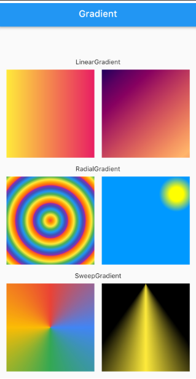

#동영상 플레이어

## 사전지식
### 시간 변환 및 String 패딩
- Duration 클래스
    - DateTime과 다르게 기간을 표현할 수 있는 클래스
- video_player 플러그인 사용
    - 영상 위치, 총 길이 등을 Duration 클래스로 반환
    - 가독성이 좋도록 String 값으로 전환

```dart
import 'package:intl/intl.dart';

void main() {
  Duration duration = Duration(seconds: 192);
  print(duration);

  print(duration.toString().split('.')[0]);
  //.기준 List 반환, 첫번째 값

  print(duration.toString().split('.')[0].split(':').sublist(1, 3).join(':'));
  // 첫번째 값을 다시 : 으로 나누고 인덱스 1~2 까지 가져와 합친 값

  print(
      '${duration.inMinutes.toString().padLeft(2, '0')}:${(duration.inSeconds % 60).toString().padLeft(2, '0')}');
  //해당 시간의 분과 : 분을 뺀 초를 표시

  print(
      '${duration.inMinutes.toString().padLeft(2, '0')}:${(duration.inSeconds.remainder(60)).toString().padLeft(2, '0')}');

  print('23'.padLeft(3, '0'));
  print('23'.padRight(3, '0'));

  DateTime dateTime = DateTime(0).add(duration);
  print(DateFormat('mm:ss').format(dateTime));
  
  //intl 을 이용한 표시
}
```

## 사전 준비
### 가상 단말에 동영상 추가하기
- 안드로이트 에뮬레이터 실행
- 에뮬레이터에 파일 드래그 앤 드롭
- 에뮬레이터 내부 Files 앱에서 파일 확인

### 이미지 추가하기
- asset/img 생성

### pubspec.yaml 설정하기
- 플러그인 추가
- 이미지 폴더 추가

```dart
  image_picker: ^1.1.2
  video_player: ^2.8.7

    assets:
    - asset/img/
```
### 네이티브 설정하기
- 갤러리 권한을 위해
- iOS
    - ios/Runner/Info.plist
    - <key>NSPhotoLibraryUsageDescription</key>
	- <string>갤러리 권한을 허가해주세요.</string>
- 안드로이드
    - <uses-permission android:name="android.permission.READ_EXTERNAL_STORAGE" />
    - 외부 저장소 데이터를 읽을 수 있도록 허용

## 레이아웃 구상
### 첫화면 : renderEmpty()함수
- 앱의 로고와 이름을 보여주고 gradient 배경 적용

### 플레이 화면 : renderVideo() 함수
- 로고 클릭후 동영상 선택 시 화면에 보여줄 위젯을 반환
- 동영상 시청 가능, 컨트롤 버튼
    - 재생, 3초 전/후 이동, 새 동영상 선택

## 구현
### renderEmpty() 함수 구현
- 동영상이 선택되지 않은 로고 화면 구현
- 동영상 파일 선택과 관련해 상태관리, StatefulWidget으로 구성
- image_picker 플러그인은 XFile형태로 값을 반환

### 배경색 그라데이션 구현
- BoxDecoration 클래스 사용



### 파일 선택 기능 구현
- _Logo 위젯에 GestureDetetor 를 추가해서 onTab() 함수가 실행 됐을 때 동영상 선택


### 플레이어 화면 구현하기
- 이전에 작업하지 않았던 renderVideo() 함수 작업
- lib/component 폴더 생성 및 동영상 재생기 파일 추가


### 동영상 플레이어 동영상 재생
- VideoPlayerController 로 조작
    - 대표적인 네임드 생성자
    - VideoPlayerController.asset : asset 파일의 경로로 동영상을 불러옴
    - VideoPlayerController.network : 네트워크 URL 로부터 동영상을 불러옴
    - VideoPlayerController.file : 파일 경로로 동영상을 불러옴
- VideoPlayerController 는 State 가 생성되는 순간 한번만 생성 되어야 하니 initState() 함수에서 선언
- CircularProgressIndicator() - 무한 루프 형태의 원형 프로그래스 바
- AspectRatio : child 에 입력되는 위젯의 비율을 정할 수 있음
    - aspectRatio 매개변수에 너비/높이로 입력하면 됨(ex:16/9)

### Slider 위젯과 동영상을 연동
- Slider 위젯을 스크롤 하면 동영상이 해당 위치로 이동
- 동영상이 실행되는 위치에 따라 자동으로 Slider 위젯이 위치
- seekTo() 함수 : 동영상을 특정한 위치로 이동

### 동영상 컨트롤 버튼 구현
- 재생/일시정지, 앞/뒤로 3초 이동 버튼, 새 동영상 선택 버튼 구현
- onPressed 매개변수와 아이콘 모양인 IconData 값만 외부에서 받는 위젯 구현
- Align 위젯
    - 자식 위젯을 부모 위젯 내에서 특정 위치에 배치하도록 함
- addLisener() 함수로 videoController 변수 상태가 바뀔 때마다 setState() 로 build() 재실행
    - addListener() 함수 실행하면 dispose() 함수에서 removeListerner() 실행
- 동영상 선택 이후 새로운 동영상의 선택
    - videoController 는 initState() 함수에서만 선언
    - 그래서 홈스크린에 있는 onNewVideoPressed 를 실행해도 변경이 없음
    - didUpdateWidget() 함수로 videoController를 새로 생성
    - p222 생성자의 매개변수가 변경됐을 때 생명주기

### 컨트롤러 감추기 기능
- 화면을 한번 탭하면 숨겨지고 다시 탭하면 나타나게
- 다트 언어에서는 List 안에서 직접 if문 사용 가능

### 타임스탬프 추가
- 현재 실행중인 위치와 동영상 길이를 slider 좌우에 배치